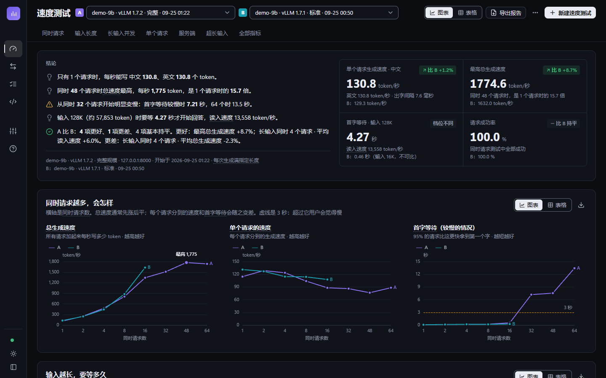
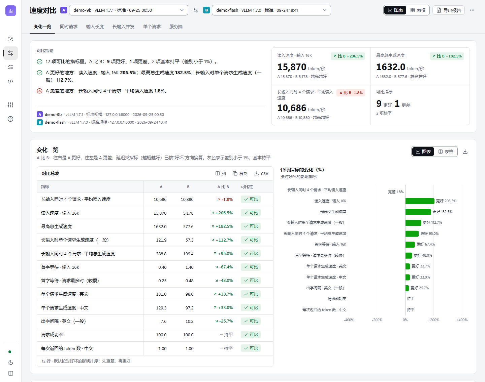
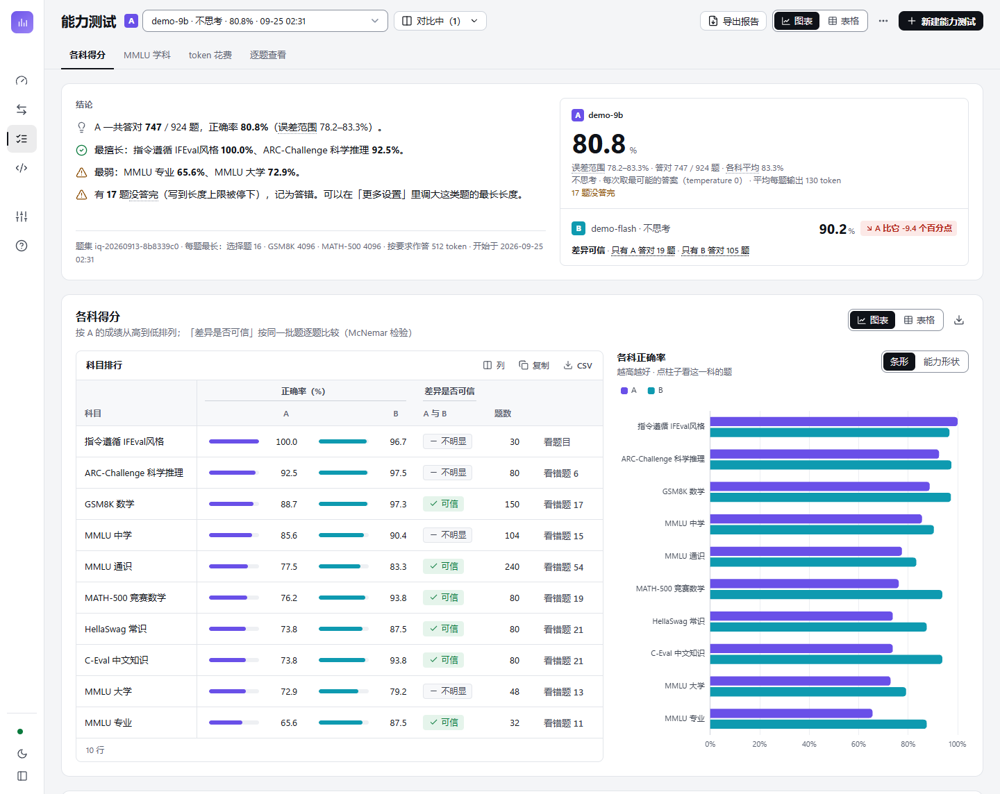
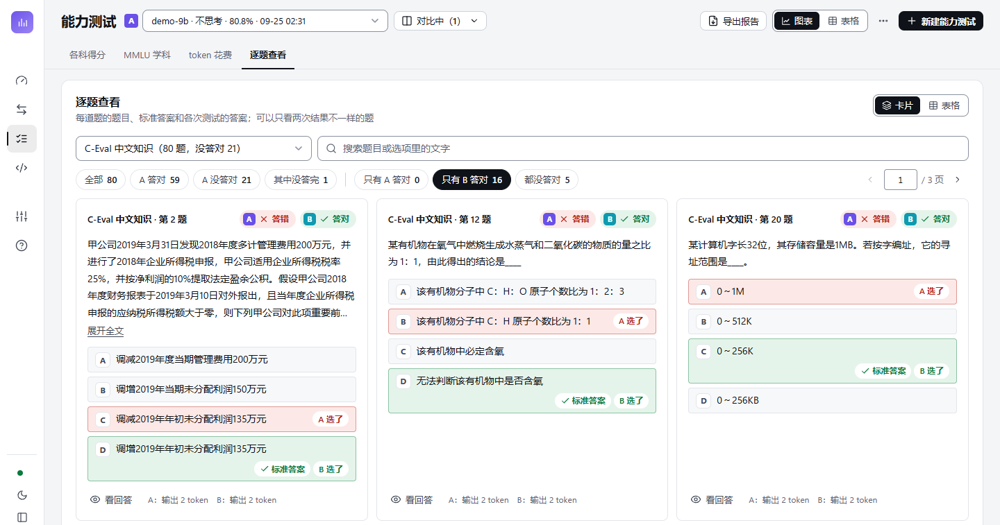
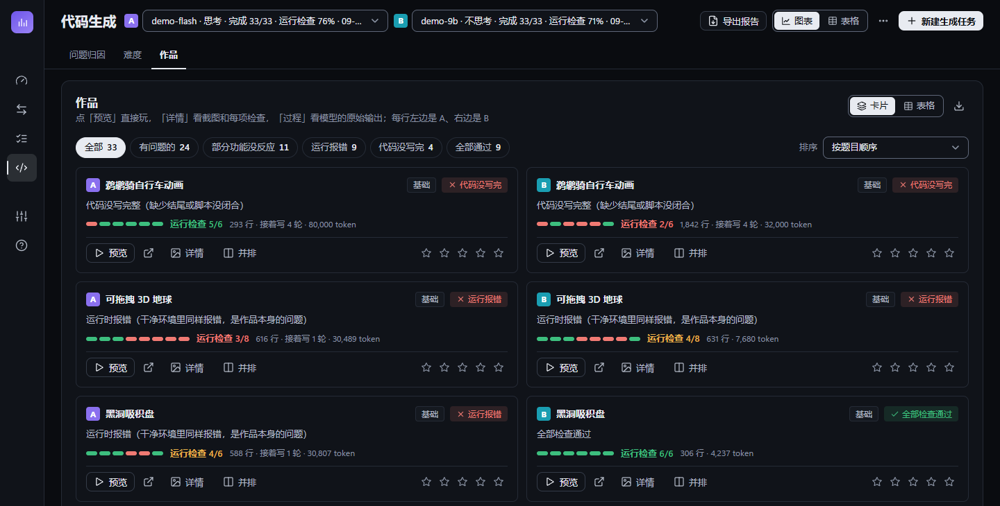
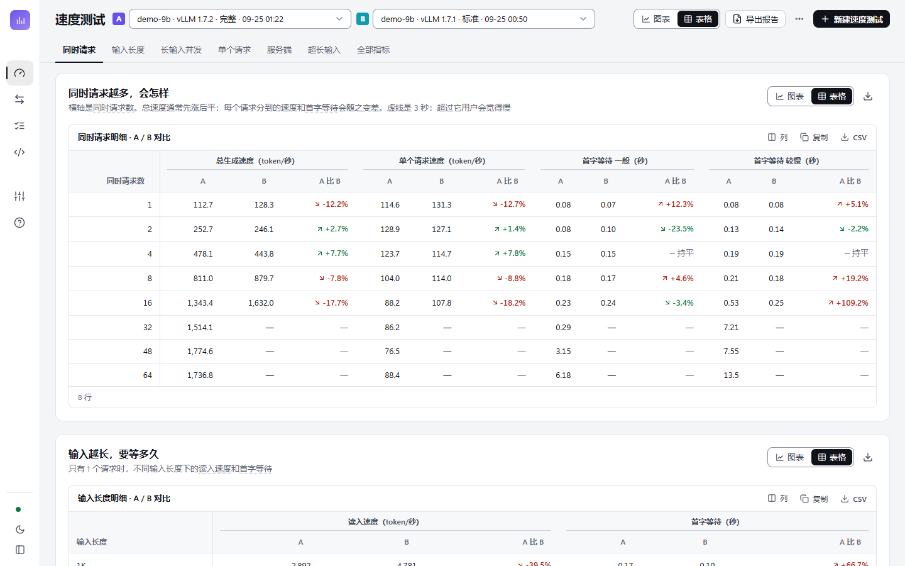
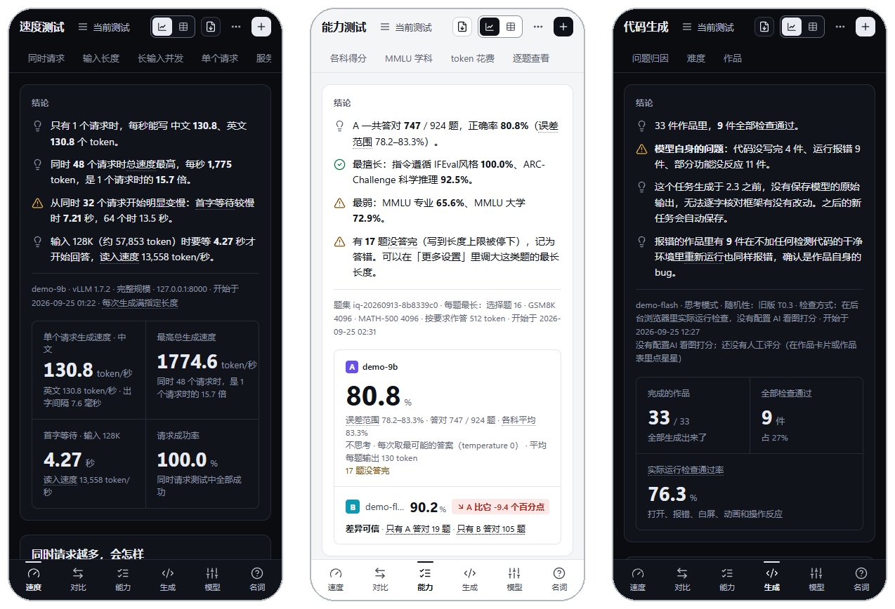
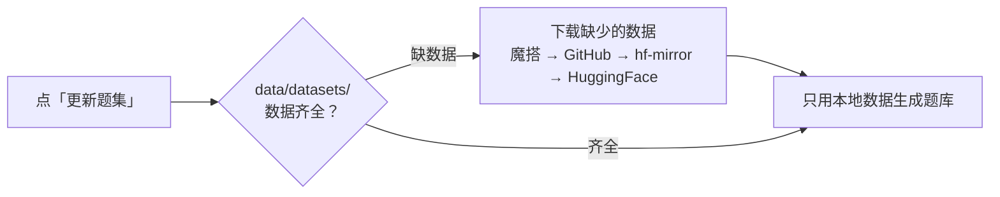

<a id="readme-top"></a>

<div align="center">

# LLM Bench Pro

**大模型推理评测一体化平台**

对 OpenAI 兼容端点做 **速度 · 能力 · 代码生成** 三维评测，<br>
同一模型跨后端（推理框架 / 版本 / 量化）做 A / B / N 多对象对比。纯 Python 标准库，下载即用。

[](https://github.com/Qixiao02/llm-bench-pro/actions/workflows/test.yml)
[](LICENSE)
[](https://www.python.org/downloads/)
[](requirements.txt)
[](#quick-start)
[](#offline)

[快速开始](#quick-start) · [功能](#features) · [截图](#screenshots) · [文档](#docs) · [参与贡献](#contributing)

<br>



<sub>速度测试页（暗色主题）：同一模型在两个 vLLM 版本上的 A / B 对比。截图均使用脱敏的演示数据。</sub>

</div>

<br>

## ✨ 亮点

<table>
  <tr>
    <td width="50%" valign="top">
      <b>🪶 零依赖，下载即用</b><br>
      纯 Python 标准库（3.8+），不需要 <code>pip install</code> 任何包；前端零 CDN 依赖，图表库 ECharts 随仓库内置。
    </td>
    <td width="50%" valign="top">
      <b>📊 三维评测</b><br>
      <b>速度</b>：性能基准 + 任务场景 + 真实请求回放；<b>能力</b>：GSM8K、MMLU、C-Eval 等官方题集（默认题库 916 题），判分对齐发布方；<b>代码生成</b>：33 题在无头浏览器里实际运行检测，可选视觉模型评审。
    </td>
  </tr>
  <tr>
    <td width="50%" valign="top">
      <b>🆚 A / B 对比</b><br>
      同一模型跨推理框架 / 版本 / 量化对比，页面上统一写成「A 比 B」；变化按好坏方向着色，档位不同的指标标为不可比。
    </td>
    <td width="50%" valign="top">
      <b>📴 离线可用</b><br>
      题集随仓库提供，开箱即用、不需要联网；页面、图表库、字体都在本地，不依赖任何 CDN。
    </td>
  </tr>
  <tr>
    <td width="50%" valign="top">
      <b>📦 一模一样的离线报告</b><br>
      把当前页面连同数据导出成一个 HTML，和系统用同一套页面代码：图表悬停、表格排序、逐题翻页都能用，双击就能打开。
    </td>
    <td width="50%" valign="top">
      <b>🗣️ 结论先行，说大白话</b><br>
      每页第一屏先用几句话说清结论；专业词换成大白话，悬停可看原来的说法；每个章节图表 / 表格一键切换，配色经色盲安全校验。
    </td>
  </tr>
</table>

<a id="screenshots"></a>

## 📸 截图

<table>
  <tr>
    <td width="50%" align="center" valign="top">
      <br>
      <b>速度对比</b><br>
      <sub>逐项「A 比 B」，往右是 A 更好、往左是 A 更差</sub>
    </td>
    <td width="50%" align="center" valign="top">
      <br>
      <b>能力测试</b><br>
      <sub>各科正确率与误差范围，McNemar 检验差异是否可信</sub>
    </td>
  </tr>
  <tr>
    <td width="50%" align="center" valign="top">
      <br>
      <b>逐题查看</b><br>
      <sub>标准答案和 A / B 的选择，这里只看「只有 B 答对」的题</sub>
    </td>
    <td width="50%" align="center" valign="top">
      <br>
      <b>代码生成</b><br>
      <sub>作品在无头浏览器里实际运行检测，A / B 并排</sub>
    </td>
  </tr>
  <tr>
    <td width="50%" align="center" valign="top">
      <br>
      <b>整页表格视图</b><br>
      <sub>所有章节一键换成表格，可排序、复制进 Excel、导出 CSV</sub>
    </td>
    <td width="50%" align="center" valign="top">
      <br>
      <b>手机上也能看</b><br>
      <sub>导航变成底部标签栏，亮色 / 暗色两套主题</sub>
    </td>
  </tr>
</table>

<a id="quick-start"></a>

## 🚀 快速开始

只需要 Python 3.8+，不用安装任何第三方包：

```bash
git clone https://github.com/Qixiao02/llm-bench-pro.git
cd llm-bench-pro
python run.py          # 浏览器打开 http://127.0.0.1:18080
```

1. 在「速度测试」页点「新建速度测试」；
2. 在右侧面板里填写服务地址 →「测试连接」（拉取 `/v1/models` 自动回填模型与框架）；
3. 点「开始测试」。

能力测试、代码生成页分别点「新建能力测试」「新建生成任务」，右侧面板同样按三步填写（服务与模型 → 测什么 → 更多设置）。

**启动参数**

```bash
python run.py                                   # 仅本机访问: http://127.0.0.1:18080
python run.py 18090                             # 换端口
python run.py --host 0.0.0.0 --token 自定义令牌   # 局域网访问, 用 http://主机:18080/?token=自定义令牌 打开
```

- 默认只监听 `127.0.0.1`。监听其他地址且未设置令牌时，启动会给出警告；令牌也可以用环境变量 `LLM_BENCH_TOKEN` 设置。
- 端口被占用时启动直接失败（Windows 上不再出现多个进程同时监听同一端口、请求落到旧进程的情况）。
- **更新代码后需要重启服务。** 页面会检测「后端代码已更新但服务未重启」以及「页面与后端版本不一致」并提示。

> [!TIP]
> 代码生成的「运行检测」需要本机装有 Chrome / Edge / Chromium（可用环境变量 `LLM_BENCH_BROWSER` 指定路径）；找不到浏览器时自动降级为源码检查，页面上会醒目标注。

<a id="features"></a>

## 🧭 功能

三类评测对应四个结果页：

| 页面 | 回答什么问题 |
|:--|:--|
| **速度测试** | 服务有多快：同时请求越多会怎样、输入越长要等多久、按真实业务施压扛不扛得住 |
| **速度对比** | 两次测试（换了推理框架、版本或量化）哪些指标变好、哪些变差、变了多少 |
| **能力测试** | 答得准不准：哪科强、哪科弱，每题花多少 token，两次测试的差距是否可信 |
| **代码生成** | 写出来的单文件网页能不能真的跑起来、操作有没有反应，问题出在模型还是评测环境 |

### 速度测试

- **基础测量**：Prefill 阶梯 · 提示词长度 × 并发矩阵（含 P50 / P90 / P95）· 单流解码（ITL 分位数 · 投机 burst）· 并发阶梯；长度阶梯与并发都可以自定义。
- **vLLM 框架指标时间线**：KV 缓存 · 前缀缓存。
- **A / B 叠图对比**：选一个对比对象 B，各章节的图叠在一起看。
- **任务场景**（按你的业务形态自由组合，默认不启用）：场景 = 任务模板 × 语料 × 负载。语料用固定种子生成，A / B 两次运行收到相同的请求序列；指标诚实：只有声明了输出契约的模板（结构化抽取 / 带 `response_format` 的自定义行）报 JSON 合法率，其余报输出长度分布。六类内置模板：
    - **对话问答**：短答 / 长文混合
    - **代码生成**：函数 / 类 / 脚本 / 修 bug
    - **结构化抽取**：商品 → 标准 JSON，报合法率
    - **RAG 问答**：1.5K / 4K / 16K 档长上下文 + 引用式回答
    - **图片理解**：多模态 content 数组，每个请求 1–4 张。默认用内置的 6 张示例图（几何图形、柱状图、色块拼图等，纯标准库画出），每张图配只问图里内容的问题；也可以用上传的图片包或服务器上的文件夹，上传和开始测试前逐张检查，损坏或小于 28×28 像素的不发
    - **自定义任务集**：上传你自己的 JSONL，完全用你的请求；页面上可以下载各种写法的模板，上传后逐行检查，有问题的行给出行号和原因
- **真实请求回放**（可选，上传线上导出的 JSONL）：两次运行的到达时间轴相同，A / B 差异全部来自服务端；回放池 cursor 跨格推进，防止命中前缀缓存。
    - **闭环**：C 个 worker 各连发 N 条，回答「C 路并发扛不扛得住」；
    - **开环**：泊松到达、按速率施压，含在途时间线与最大在途，回答「线上到达速率下会不会越排越长」。
- **测得准**：正式测量前按「实际会跑的（输入长度, 并发）组合」预热一轮（结果丢弃），避免引擎按 batch shape 的编译 / 冷启动拖慢首格；场景 / 矩阵格遇到基础设施型失败（如实例卡死）会等服务恢复后**整格重跑**（最多 3 次），每轮失败都在结果与报告中全量披露。
- **自动数据提示**：如并发增加时聚合吞吐下降、投机解码只在单并发生效、请求失败等。

### 速度对比

- 两次测试的关键指标差异：「A 比 B」变化图（往右是 A 更好、往左是 A 更差，延迟类已按好坏方向换算；档位不同的指标标为不可比）/ 叠图 / 矩阵逐档 / 明细表 / 场景对比。
- 支持跨后端对比（标注框架名 + 版本），**可导出离线报告**。

### 能力测试

- **题集**：GSM8K · MMLU（全 57 科，分中学 / 大学 / 专业 / 通识四层）· MATH-500 · ARC · HellaSwag · C-Eval 六个官方题集，加上本项目编写的中文指令遵循题（IFEval 风格），默认题库共 916 题；三档题量；题库版本化，旧题库保留、可切换，一键拉取更新（见[离线使用与题集下载](#offline)）。
- **统计**：Wilson 95% CI（页面上叫「误差范围」）；多对象同屏对比。
- **图表**：各科横向柱状图 + 雷达图；正确率与每题 token 花费（折线加面积 / 散点两种看法，点某一科直接看这一科的题）。
- **逐题查看**：卡片 / 表格两种看法。卡片按网格排、分页显示（每页 6 / 12 / 24 / 48 题，可输入页码跳转，键盘 ← → 翻页）；每道题显示题目、选项、标准答案和模型的答案，可按科目 / 对错筛选、搜索；对比时可只看「只有 A 答对」「只有 B 答对」的题；点开可看模型的回答原文和发给模型的原文。

### 代码生成

- **33 题四档**单文件前端生成：鹈鹕骑车 / Flappy / 俄罗斯方块 / 3D 迷宫 / 流体 / Win95 + 实战美观题 10 道。
- **无头浏览器运行检测 + 视觉模型清单评审**，按「模型自身问题 / 评测环境问题」归因（口径见[文档](#docs)）。
- **逐轮保存模型原始输出**，可以核对框架是否改动过代码。
- **沙箱隔离预览**（与评测时相同的环境，不联网）；也可以**在新标签页打开**：像普通网页一样运行，可以加载外部字体和脚本，仍然隔离、碰不到本系统的数据。
- 人工打星，A / B 并排。

### 界面与交互

整体是「左侧窄导航 + 顶部工具条 + 结果区」：左侧图标导航鼠标移上去展开，底部按钮可固定展开；手机上导航变成底部标签栏。工具条固定在顶部，下面一行是章节目录，滚动时自动高亮当前章节，点一下直接跳过去。

每个结果页都按「结论 → 关键指标 → 分章节」排列：第一屏先用几句大白话说明结果（例如「同时 48 个请求时总速度最高」）和关键数字；下面每个章节是一个面板，右上角可以在 **图表 | 表格** 之间切换，工具条上的 **图表视图 / 表格视图** 一键把整页切成全表格（会记住上次的选择）。

<details>
<summary><b>表格、对比方向、大白话与配色的细节</b></summary>

- **表格**统一支持：点表头排序（再点一次反向、第三次取消）、表头和第一列固定、选择显示哪些列、搜索、**复制**（直接粘进 Excel）、**导出 CSV**（带 BOM，Excel 打开中文不乱码）；行多的表格分页显示，可以点页码、输入页码跳转、选每页多少行；排序、隐藏的列和每页行数都会记住。
- 工具条「更多」里可以 **导出本页全部表格**（一个 CSV 文件，每张表一段）、切换 **紧凑显示**（行距更小，一屏看更多行）、切换亮色 / 暗色。
- **对比的方向**：A 是正在看的测试，B 是拿来比的，页面上统一写成「A 比 B」——变化 = A 相对 B（如「比 B +8.7%」），结论写「A 有 4 项更好、1 项更差」，大数字显示 A 的值；能力测试的差距 = A 的正确率 − B 的正确率。
- **大白话**：页面上的专业词都换成了大白话（如 TTFT →「首字等待」、Prefill →「读入速度」、p95 →「较慢的情况」、置信区间 →「误差范围」）。带虚线下划线的词，鼠标放上去能看到原来的专业说法，点一下打开「名词解释」并定位到这个词（名词解释可以搜索）。
- **配色与可读性**：图表配色经色盲安全校验（亮 / 暗两套），同一个测试在所有图里颜色固定（A、B 各一种颜色），不使用双纵轴（两种单位拆成两张图）；文字与背景的对比度都经过检查（正文 ≥ 4.5:1，图形和控件边框 ≥ 3:1）。

按数据的用途，表格有 7 种形态：

| 形态 | 用在哪里 |
|---|---|
| 明细表 | 各档位的完整数字、代码生成作品清单、能力测试逐题（点行展开看题目和回答） |
| A \| B \| 变化 对比表 | 速度对比页、速度测试选了对比对象 B 后的各章节；变化按好坏方向着色，档位不同的指标标为不可比 |
| 热力表 | 长输入 + 同时请求 的各档数字，颜色越深数值越大；对比时改为 B 相对 A 的变化（绿色更好、红色更差） |
| 排行表 | 能力测试各科正确率、代码生成各题得分，行内带条形 |
| 分组表 | MMLU 按学科大类分组，可折叠 |
| 检查矩阵表 | 代码生成 作品 × 检查项（过 / 没过 / 没做这项检查） |
| 统计摘要表 | 出字间隔、单个请求速度的 一般 / 较慢 / 最慢 |

</details>

### 导出离线报告

四个结果页的工具条上都有 **导出报告**：把当前看到的页面连同数据导出成一个 HTML 文件，双击就能打开，不需要启动服务。

- 用的是和系统里同一套页面代码（样式、图表库、脚本都内联在文件里），所以看到的和系统里一模一样：图表悬停、图表 / 表格切换、表格排序和导出、逐题翻页都能用；导出时选中的 A / B、主题、视图和筛选也一起带上。
- 报告是只读的（没有新建、刷新、删除、重新检查），数据是导出那一刻的样子。
- 能力测试的报告带着逐题和模型的回答原文；代码生成的报告带着作品网页、检查截图和生成过程，作品在报告里也能预览、在新标签页打开。
- 文件里只有测试结果，不带 API Key、表单里填过的服务地址和本机路径；大小一般 1.5–5 MB。

### 运行与管理

<details>
<summary><b>模型管理、新建面板、停止与续跑、删除等</b></summary>

- **模型配置管理（免复制粘贴）**：左侧导航「模型管理」打开右侧面板，统一维护端点配置（名称 / API 地址 / API Key / 模型名，存本机数据库、Key 默认遮住）。
    - **已保存的模型**：上方表格列出全部配置（多于 6 个时可搜索），每行可「填入」「编辑」「删除」；
    - **添加 / 编辑**：下方表单直接填写保存，名称留空自动按「模型 · 主机」命名；
    - **填入**：一键把配置同时填入速度测试、能力测试、代码生成三个新建面板；
    - 三个「新建」面板第 1 步「服务与模型」里都有「从已保存的模型填入」下拉，选中即填当前表单（包括 Key），不用再复制粘贴。
- **新建测试**在右侧面板里按三步填写（服务与模型 → 测什么 → 更多设置），面板底部实时显示「这次将测 / 将考 / 将写」什么；运行日志也在面板里，关掉面板后侧栏和页头会显示「进行中」，点一下重新打开。
- **停止与续跑**：运行中的任务可在日志栏点「停止」，不再开始新请求，已完成的结果保留；能力评测停止或中断后可「续跑」，只补做未完成的题。
- **删除**：工具条右侧可删除所选运行（代码生成会一并删除作品文件）；删除后 `data/results/` 中的同名 JSON 不会在重启时被重新导入。
- **端点冲突保护**：性能测试与其他测试同时访问同一模型端点时，启动前会要求确认（同时运行会污染吞吐与延迟数据）。
- **其他**：暗色为默认主题，侧栏底部或工具条「更多」里可切换亮色（新主题从点击的位置圆形展开，整页连图表一起过渡；系统设置了「减少动画」时直接切换）；时间按浏览器本地时区显示；运行中的任务在刷新页面后会自动恢复日志跟踪。

</details>

<a id="offline"></a>

## 📴 离线使用与题集下载

能力测试的题集在 [`banks/`](banks/) 里随仓库提供，**开箱即用、不需要联网**。页面、图表库、字体也都在本地，不依赖任何 CDN。

需要重新生成题集时，点能力测试新建面板「更多设置」里的 **更新题集**，分两步进行：

1. **下载**：先把原始数据下载到本地 `data/datasets/`（已下载的跳过）。默认用魔搭（ModelScope）加载脚本里的数据地址（阿里云 OSS，国内直连），不通时依次回退到 GitHub（国内镜像测速后用最快的）、hf-mirror、HuggingFace；大压缩包只取需要的文件，不整包下载。
2. **生成**：只用本地数据生成题库。本地数据齐全后，生成题库完全不需要网络。



没有网的机器：把能联网机器上的 `data/datasets/` 拷过去即可。也可以用命令行：

```bash
python -m llm_bench_pro.bankman status            # 看本地数据
python -m llm_bench_pro.bankman download          # 只下载
python -m llm_bench_pro.bankman build --offline   # 不联网生成
```

<a id="docs"></a>

## 📖 文档

各项评测口径与参考资料，点开查看。

<details>
<summary><b>项目结构</b></summary>

```
llm-bench-pro/
├── run.py                  # 启动入口: python run.py [port] [--host] [--token]
├── llm_bench_pro/          # 核心包
│   ├── server.py           # HTTP 服务 + 全部 API(多线程, 任务取消/续跑/端点冲突保护/访问令牌)
│   ├── version.py          # 应用版本号(与 web/static/app.js 的 UI_VERSION 一致)
│   ├── bench.py            # 性能基准引擎(流式 TTFT/ITL/并发屏障同步 + 任务场景/回放场景)
│   ├── vision_assets.py    # 看图场景的图片: 文件头检查(PNG/JPEG/WebP/GIF 宽高) + 内置示例图片(手写 PNG 编码)
│   ├── iq.py               # 智力测试引擎(官方判分口径 + Wilson CI)
│   ├── gen.py              # 生成测试引擎(33 题四档, 生成 + 续写 + 重新评测)
│   ├── geneval.py          # 生成作品评测: 运行检测 / 源码检查降级 / 视觉评审
│   ├── gen_specs.py        # 逐题评测规格: 交互脚本 / 功能断言 / 评审清单
│   ├── cdp.py              # 纯标准库 Chrome DevTools 协议客户端(无头 Chrome/Edge)
│   ├── bankman.py          # 题库管理(原始数据下载到本地/多源回退与限速退避/离线生成/版本化)
│   ├── store.py            # SQLite 结果库(建表/增量写/读/导入导出)
│   ├── export_html.py      # 离线报告: 同一套页面(内联样式/图表库/脚本) + 测试数据, 合成一个可直接打开的 HTML
│   ├── report.py           # 旧版速度测试 HTML 报告(自包含·内联 SVG·A/B 对比·失败重跑披露, 命令行用)
│   └── sinks.py            # 结果落地抽象: JSON 文件 / SQLite / 组合
├── web/
│   ├── index.html          # 页面结构与图标
│   └── static/             # app.css(设计 token/组件) · app.js(逻辑与 ECharts 图表) · vendor/(echarts.min.js 及其 LICENSE、NOTICE)
├── tests/                  # 标准库 unittest: 判分/统计/存储/服务/性能引擎/生成评测/题库; js/ 为前端逻辑断言
├── banks/                  # 题库版本资产(iq-*.json, 多版本共存); 数据来源与许可见 banks/README.md
├── docs/screenshots/       # README 截图
├── .github/                # CI(workflows/test.yml)、Issue / PR 模板、CODEOWNERS
└── data/                   # 运行数据(gitignore, 程序自动创建)
    ├── llm_bench.db        # 结果库, 页面上的所有测试都在这里(可用 $LLM_BENCH_DB 改路径)
    ├── results/            # 命令行跑出的 JSON 结果; 从别的机器拷来的结果也放这里, 服务启动时自动入库
    ├── works/              # 代码生成的作品 HTML、检测截图、模型原始输出(页面地址 /works/…)
    ├── datasets/           # 「更新题集」下载的原始数据(已下载的跳过; 拷到没网的机器即可离线生成)
    ├── replay/             # 上传的真实请求回放文件
    ├── scenario/           # 上传的自定义任务集与图片包
    └── export/             # `store export` 默认导出位置
```

代码只放在 `llm_bench_pro/`、`web/`、`tests/`，运行产生的一切都在 `data/` 下。2.9 之前 `results/`、`works/` 在项目根，服务启动时会自动搬进 `data/`（重名的不覆盖，会在启动输出里提示）。

</details>

<details>
<summary><b>代码生成评测口径</b></summary>

参照 ArtifactsBench（真实渲染 + 交互截图 + 清单式多模态评审），分两层，结果分别报告、不做加权混合：

1. **运行检测**（确定性、可复现，需本机安装 Chrome / Edge / Chromium，可用 `LLM_BENCH_BROWSER` 指定路径）
    - 断网加载（外部脚本 / 样式被拦截即判「非自包含」，网络字体除外），`Math.random` 固定种子，`alert` / `confirm` 置空
    - 检查项：代码完整输出、加载无卡死、无未捕获异常 / 控制台错误、首屏非白屏、应有动画的题空闲时持续渲染、移动端 390px 无横向溢出
    - 逐题交互脚本（`gen_specs.py`）：真实按键 / 点击 / 拖拽 / 滚轮；计算器、终端、待办等题用**功能断言**判定（如 7+8 必须显示 15），其余以画面 / DOM 变化是否超出空闲基线、作品事件处理器是否被调用判定
    - 作品报错时，会在**不注入任何检测脚本**的干净页面里按同样步骤再跑一遍（对照运行）：同样报错即作品自身的 bug，否则提示「可能是检测环境引起」
    - 未找到浏览器或浏览器启动失败时降级为源码检查（去注释后匹配），页面醒目标注「没有实际运行」并给出原因，修复后可一键重新检查
    - 以管理员身份运行服务时，Chrome 会以普通权限重启自身；评测会接管重启出的浏览器（并传 `--do-not-de-elevate`），临时目录记录所属进程，所属进程退出后遗留的后台浏览器会被自动回收。旧版本遗留的后台浏览器可在没有评测运行时手动清理：`python -m llm_bench_pro.cdp --reap-all`
2. **视觉评审**（可选，需一个支持图片输入的 OpenAI 兼容模型）：题目要求 + 运行检测报告 + 截图序列 + 源代码 → 逐题清单与通用项（视觉 / 完成度 / 代码）逐项 0–10 分，汇总为 0–100；代码中声称但截图与检测均未体现的功能最多 3 分

生成过程本身也可核对（2.3 起）：

- **采样**：默认按官方推荐（思考 temperature 0.6 / top_p 0.95，不思考 0.7 / 0.8，top_k 20，seed 42）；旧版统一 0.3，接近贪心，小模型写长文件容易陷入无限重复。新建面板可改为旧版口径或自定义
- **重复输出检测**：流式生成时检测逐字循环（严格周期）和内容高度雷同（8000 字符窗口压缩率连续 3 次低于 0.13；正常作品实测不低于 0.19），命中立即停止且不再续写，作品标注「陷入重复输出」
- **原始输出留档**：每题逐轮保存模型原始输出、思考长度、结束原因、token 和拼接方式到 `data/works/<run>/<题>.gen.json`；作品卡片「生成过程」里可查看每一轮原文（重复部分标红），并用大白话列出框架做过的全部处理（去掉说明文字 / 代码块标记、拼接续写等）。除列出的处理外，保存的作品与模型输出逐字一致

已有运行可在页面点「重新检查」，或用命令行：

```bash
python -m llm_bench_pro.geneval --run gen_20260914_xxx --judge-base http://host:8000 --judge-model Qwen2.5-VL-72B
```

</details>

<details>
<summary><b>能力评测口径</b></summary>

- **判分对齐发布方**：MMLU / ARC / HellaSwag / C-Eval 选项提取、GSM8K `####`、MATH-500 `\boxed{}` + 官方 `strip_string` 规范化、IFEval 风格规则校验
- **输出预算（max_tokens）**：选择题 16、GSM8K 2048、MATH-500 4096、指令遵循 320（默认值为本项目设定，对齐主流口径的做法；启动器「高级设置」可按题型覆盖，数值钳制在 8–32768，只影响「能否答完」、不影响判分）；思考模式统一 32K（超出模型上下文时自动收缩）。各运行的预算明示在结果卡片上
- **Token 花销作为能力维度**：结果卡片显示入 / 出 token 总量与每题输出均值，分科表有各科 tok/题 列；A/B 对比时显示较 A 的增减百分比（同等正确率下花得更少更高效）
- **采样**：默认「官方推荐」——思考模式 temperature 0.6 / top_p 0.95 / top_k 20（贪心解码容易陷入重复），非思考模式贪心；可改为贪心或自定义，采样时固定 seed=42。端点不支持 top_k / seed 等非标准参数时自动去掉并记录
- **截断与失败**：达到输出上限的题标记为「截断」、请求异常标记为「失败」，均计为答错并单独统计；每题记录模型答案和回答原文（超过 6000 字时保留开头 2000 + 结尾 4000 字），答错的题另存思考过程的最后 1500 字，可在「逐题查看」里逐题排查（旧测试只保存了答错题回答的最后 240 字）
- **统计**：总体准确率按题数计，同时给出科目宏平均；多次运行对比时对共同题目做 McNemar 配对检验，标注差异是否显著（p<0.05）
- **版本**：评测程序版本记录在结果中（当前 1.4.0），旧版本结果在页面上会提示口径差异

</details>

<details>
<summary><b>测量口径（速度测试）</b></summary>

- TTFT = SSE 首个 content / reasoning delta；解码吞吐 = (completion_tokens - 1) / 流内解码跨度（usage 精确计数）
- 默认固定输出长度（`ignore_eos`），避免模型提前结束导致吞吐偏高、不同后端不可比；**任务场景与回放不发送 `ignore_eos`**，测真实任务行为（合法率 / 真实输出长度）
- 每次测量带唯一批次号，防前缀缓存命中虚高；聚合吞吐 = 轮总 token ÷ 轮墙钟（屏障同步）
- **输入长度按被测模型的实际 token 数拼**：每次测试开始时发 2 个只生成 1 个 token 的请求，量出拼接用的那句话在这个模型上占多少 token，再按目标长度算重复几句（「1K」= 1000 token，误差不超过半句）；「看资料回答」的资料段落同样先校准；结果里记下校准值和每档的目标长度。服务没有返回 token 用量时退回旧估算，并在结果页注明
- 1.5 之前按「每句 77.5 token」估算，在新一代分词器（如 Qwen3）上实际只有标称长度的 45% 左右（例如标「128K」的实际约 5.8 万 token）。这些旧结果不用重跑：页面按实际长度显示（原来标 128K 的显示为 57.9K），对比时也按实际长度判断能不能比
- 场景指标均为「先逐请求计算、再排序取分位」；开环回放为泊松到达、绝对时间调度（无累计漂移），在途上限 128、超限丢弃并计数；回放池 cursor 跨格推进，防止重复请求命中前缀缓存
- 能力评测见「能力评测口径」；全部报告 Wilson 95% 置信区间，题集版本不一致的对比自动警告

</details>

<details>
<summary><b>结果存储</b></summary>

- 服务端所有运行写入 SQLite（`data/llm_bench.db`，WAL 模式）：每个 phase / 科目 / 作品增量提交，崩溃不丢已完成部分
- 运行状态 `status`：running / done / failed / interrupted / cancelled；进程被杀的运行按心跳超时（5 分钟）自动判为 interrupted
- 能力评测逐题增量保存（每 20 题提交一次），性能测试按阶段提交，代码生成按作品提交
- 性能列表接口只返回摘要，页面按需加载单次运行详情
- 人工打星为单行更新，生成测试运行中也可打星
- 服务启动时自动导入 `data/results/` 中库里还没有的 JSON（旧数据零迁移成本）

```bash
python -m llm_bench_pro.store import            # 导入 data/results/*.json (幂等, --force 覆盖内容变化者)
python -m llm_bench_pro.store check             # 校验库与 data/results/*.json 往返等价
python -m llm_bench_pro.store export            # 导出为 JSON 到 data/export/ (--out 目录 / --kind perf|iq|gen / --run RUN_ID)
python -m llm_bench_pro.store stale             # 手动标记心跳超时的运行为 interrupted
```

</details>

<details>
<summary><b>API 一览</b></summary>

| 接口 | 说明 |
|:--|:--|
| `GET /api/version` | 服务版本、启动时间、提交、是否需要重启 |
| `GET /api/results[?summary=1]` | 速度测试结果列表（`summary=1` 只返回摘要） |
| `GET /api/iq-results[?full=1]` | 能力测试结果（`full=1` 含逐题结果） |
| `GET /api/gen-results` | 代码生成结果 |
| `GET /api/banks` | 题库列表 |
| `GET /api/status` · `/api/iq-status` · `/api/gen-status` · `/api/bank-status` | 速度测试 / 能力测试 / 代码生成 / 更新题集 任务的状态 |
| `GET /api/datasets` | 本地题集数据（`data/datasets/`）是否齐全 |
| `GET /api/run?id=<run_id>` | 单个运行的完整文档 |
| `GET /api/export?id=<run_id>` | 下载 JSON |
| `POST /api/export-html` | `{page: dash\|cmp\|iq\|gen, id, cmp:[…], title, state, ui}` 离线报告：当前页面同一套界面 + 数据，返回一个自包含 HTML（页面上的「导出报告」） |
| `GET /api/report?id=<run_id>[&cmp=<run_id>]` | 旧版速度测试 HTML 报告（内联 SVG，命令行 / 脚本用） |
| `GET /api/replay-list` | 已上传的回放文件 |
| `POST /api/replay-upload` | `{name, content}` 上传 JSONL（内容寻址、幂等，≤ 15 MB） |
| `GET /api/scenario-list` | 任务集（含可用行数）与图片包（含尺寸范围、太小的张数）清单 |
| `POST /api/scenario-upload` | `{kind: tasks\|images, ...}` 上传自定义任务集 / 图片包，返回逐行 / 逐张的检查结果 |
| `GET /api/iq-items?id=<run_id>[&cmp=<run_id>,…]` | 逐题列表（题目 / 标准答案 / 各次作答摘要） |
| `GET /api/iq-answer?ids=<run_id>,…&sid=&idx=` | 某题回答原文 |
| `GET /api/iq-wrong?id=&sid=` | 某科错题 |
| `GET /api/iq-compare?a=&b=` | 配对显著性 |
| `POST /api/probe` · `start` · `iq-start` · `iq-resume` · `gen-start` · `gen-eval` · `gen-rate` · `replay-upload` · `bank-update` · `cancel` · `run-delete` | 测试连接、启动测试、续跑、重新检查、打星、上传回放、更新题集、停止、删除运行等操作 |
| `GET /works/<run>/<task>.html[?open=1]` | 生成作品：默认给沙箱 iframe 预览（不联网，与评测环境相同）；`?open=1` 在新标签页打开（可加载外部资源，仍是隔离的沙箱） |

启用令牌时，接口需带请求头 `X-Bench-Token`，或通过 `/?token=` 打开页面获得的 Cookie。

</details>

<details>
<summary><b>命令行（生产服务器直跑）</b></summary>

```bash
python -m llm_bench_pro.bench --url http://host:8011 --model NAME --suite standard \
    --metrics-url http://host:8011/metrics --lens 1,2,4,8,16 --conc-ladder 1,2,4,8 \
    --framework 1Cat-vLLM --fw-version 1.6.5 --tag baseline

# 任务场景(按业务形态组合) + 真实请求回放(闭环 + 开环)
python -m llm_bench_pro.bench --url http://host:8011 --model NAME \
    --scn chat,code,rag --scn-conc 4,8 --rag-ctx 4000,16000 \
    --vision-dir /data/images --vision-img 2 \
    --custom-file my_tasks.jsonl \
    --replay-file real.jsonl --replay-conc 8,16 --replay-rates 2,5
```

- 默认输出 `data/results/<run_id>.json`（拷回本机 `data/results/` 后服务启动即自动入库）；`--sink db` 直接写库，`--sink both` 两者都写，`--db PATH` 指定库。
- 场景里有 `vision` 但不给 `--vision-dir` 时用内置示例图片。请求失败时记下状态码和服务端返回的原因（前 300 字，例如 `HTTP 400: {"error": ...}`），页面的失败说明里直接能看到。
- 默认发送 `ignore_eos` 固定输出长度（每次生成满 max_tokens，保证不同后端吞吐可比），`--no-fixed-output` 关闭；端点不支持时自动关闭并在结果中注明。

</details>

<details>
<summary><b>测试</b></summary>

```bash
python -m unittest discover -s tests     # 全部使用临时数据库与本地模拟服务, 不访问真实模型
python tests/run_coverage.py             # 覆盖率(自研 ~100 行, 纯标准库; 结果写入 coverage.txt)
```

- **后端 Python**：`test_bench_gen / test_iq / test_server / test_store / test_report / test_bankman` —— 覆盖压测引擎、能力评测判分、HTTP 服务层（含安全门禁与版本锁）、SQLite 存储契约、离线报告的自包含性 / 转义 / SVG 完整性等内容级断言，以及题集下载与离线生成（本地模拟服务器，不联网）。
- **前端 JS**：`test_frontend` —— 有 Node 则运行（`node --check` 语法门 + DOM 桩加载 app.js 全文跑纯逻辑断言：esc / fmt / 坐标轴 / 淡色守卫 / 名词解释 / 问题归因 / 沙箱策略），无 Node 自动跳过，不破坏零依赖承诺；ECharts 渲染与交互以浏览器验证为准。
- **覆盖率**不引第三方库：`sys.settrace`（含子线程补丁）采分子、`ast` 数语句行做分母；浏览器池类模块（cdp / geneval / gen_specs）需真实 Chrome，数字低是如实反映。
- **CI**：每个 Pull Request 和 `main` 的推送都会在 GitHub Actions 上跑全部单元测试（Ubuntu Python 3.8 / 3.13、Windows Python 3.13）。

</details>

<a id="contributing"></a>

## 🤝 参与贡献

欢迎提 Issue 和 Pull Request！

1. Fork 本仓库，从 `main` 新建分支；
2. 修改并提交——提交前先跑 `python -m unittest discover -s tests`；
3. 推到你的 Fork，向本仓库的 `main` 发起 Pull Request。

`main` 分支受保护：所有改动都要通过 PR 合并，需要维护者审核、自动测试通过。详见 [CONTRIBUTING.md](CONTRIBUTING.md)。

<a id="license"></a>

## 📄 许可与致谢

本项目代码以 [MIT 许可](LICENSE) 发布。

**第三方组件**

- [Apache ECharts](https://echarts.apache.org/) 5.5.1：Apache-2.0，位于 [`web/static/vendor/`](web/static/vendor/)（`echarts.min.js`，约 1 MB），附带其 LICENSE 与 NOTICE；所有图表都用它在本地渲染，不依赖外网
- 图标路径参考 [Lucide](https://lucide.dev/)（ISC）

**题库数据**来自以下公开数据集，各自保留原许可，**不属于 MIT**：

| 数据集 | 许可 |
|:--|:--|
| GSM8K | MIT |
| MMLU | MIT |
| MATH-500 | MIT（来自 PRM800K / MATH） |
| ARC | CC BY-SA 4.0 |
| HellaSwag | MIT |
| C-Eval | CC BY-NC-SA 4.0（**禁止商用**） |
| 中文指令遵循 | 本项目编写（MIT） |

详情见 [banks/README.md](banks/README.md)。

<p align="right"><a href="#readme-top">回到顶部 ↑</a></p>
